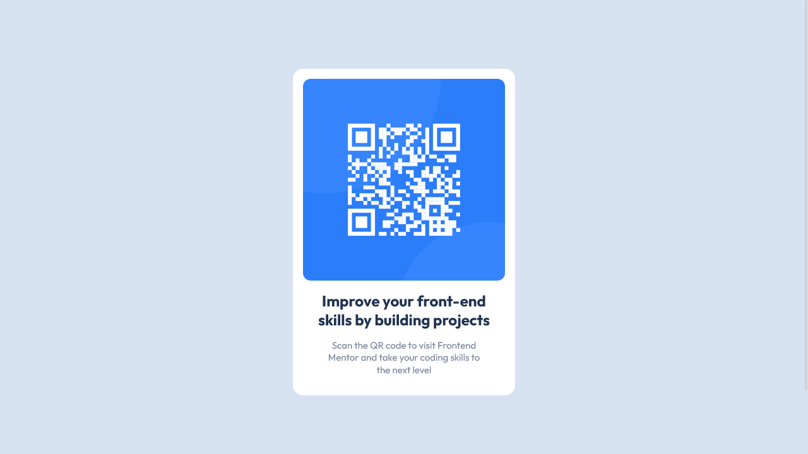

# Frontend Mentor - QR code component solution

This is a solution to the [QR code component challenge on Frontend Mentor](https://www.frontendmentor.io/challenges/qr-code-component-iux_sIO_H). Frontend Mentor challenges help you improve your coding skills by building realistic projects.

## Table of contents

- [Screenshot](#screenshot)
- [Links](#links)
- [Built with](#built-with)
- [Author](#author)

### Screenshot

### Links

- Live Site URL: [@GitHub](https://htmlpreview.github.io/?https://github.com/xdelmo/qr-code-component/blob/master/index.html)

### Built with

- Semantic HTML5 markup
- CSS custom properties
- Flexbox
- Mobile-first workflow

## Author

- Website - [Emanuele Del Monte](https://www.emanueledelmonte.com)
- Frontend Mentor - [@xdelmo](https://www.frontendmentor.io/profile/xdelmo)
